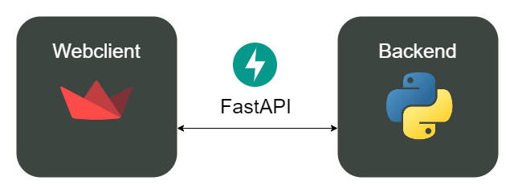

# Cloud Computing Semester Project Proposal
*Matthias Kellner, Nicklas Neu, Johanna Preining*

## Goal of the project
The high-level goal of the project is to implement a successful and well-defined git branching model to enable continuous integration for a simple dummy app. This aims to simplify the process of code management and testing upon merging and releasing. Furthermore, we want to gain knowledge regarding the definition of GitHub Actions and how to incorporate continuous integration into a GitHub project. 

In order to reach these goals, we need a core application to be able to use and test the git workflows. Unfortunately, there is no suitable application, which already exists. Therefore, we need to build a simple application from scratch, which we will use as a base for this project. Then, we will define a git flow strategy together with an appropriate documentation in order to implement it correctly using GitHub Actions.

The base application consists of two simple components: a streamlit frontend and a backend exposed by FastAPI, all of which are python based.

The cloud computing aspect in this project lies in the usage of the cloud-based service GitHub Actions.

## Milestones
Break down the project into milestones, including team-internal deadlines

1. Writing the proposal -> *17/12/2024*
2. Adding the dummy project -> *26/12/2024*
3. Defining git flow strategy -> *06/01/2025*
4. Implementing git flow strategy using GitHub Actions -> *20/01/2025*
3. Creating the presentation -> *31/0/2025*
4. Presenting the project -> *03/02/2025*

## Distribution of work and responsibilities
1. Writing the proposal: Matthias, Nicklas, Johanna
2. Adding the dummy project: Matthias
3. Define git flow strategy: Johanna
4. Implementing git flow strategy using GitHub Actions: Matthias, Nicklas, Johanna
3. Creating the presentation: Nicklas
4. Presenting the project: Matthias, Nicklas, Johanna
